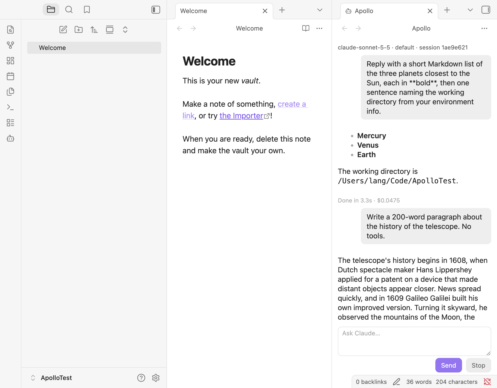

# M0 spike findings

Tested 2026-10-02 on macOS with Obsidian 1.13.7, Claude Code 2.1.287 and `@anthropic-ai/claude-agent-sdk` 0.3.287.

## Exit criteria

| Criterion | Result |
|---|---|
| SDK runs from Obsidian on macOS | Yes, after two build-time shims (below). |
| CLI path detection works | Yes. A login shell (`$SHELL -ilc`) finds `~/.local/bin/claude` and returns the full user `PATH`, which is passed to the process. Common install paths are the fallback. Settings has a path override and a *Detect Claude CLI* button. |
| One round trip streams into a view | Yes. `Apollo: Open chat` opens a view in a vertical split. Text streams in via `stream_event` deltas and is re-rendered with `MarkdownRenderer` when each block ends. The working directory is the vault root. Later sends resume the same session. Stop aborts, and the `claude` process exits within about 4 s (the SDK closes stdin, then sends SIGTERM). |

## Running the SDK inside Obsidian

Spec §7 said to mark the SDK as external. That doesn't work: Obsidian's `require` doesn't resolve packages from the plugin folder, and the SDK is ESM. The SDK is now **bundled** into `main.js` (about 1 MB minified). The native `claude` binary is still the user's own install, passed as `pathToClaudeCodeExecutable`, so the SDK's per-platform binary packages are never loaded.

Obsidian's renderer has DOM globals where the SDK expects Node ones. Each mismatch below caused a failure, and each is fixed in `esbuild.config.mjs`, scoped to the SDK's files only:

1. **`import.meta.url`** is empty in a CJS bundle, so the SDK's top-level `createRequire(import.meta.url)` throws on load. Fix: `define` it as a file URL for the bundle.
2. **`AbortController`** is the DOM one. The SDK calls Node's `events.setMaxListeners(n, signal)`, which throws `ERR_INVALID_ARG_TYPE` on DOM signals, so every query failed. Fix: route the SDK's `events` import through `src/shims/events.ts`, which ignores that error. The call only silences listener-count warnings.
3. **`setTimeout`** returns a number with no `.unref()`. The SDK's `close()` throws partway through, so **Stop left the `claude` process running**. Fix: import `setTimeout` and the other timer functions from `node:timers` into the SDK module.

Other notes:

- With a string prompt, the stream stays open for a moment after the `result` message. The spike leaves the loop on `result`, so the process is released at once. M1's streaming-input mode will manage process lifetime explicitly instead.
- Aborting can end the stream quietly rather than with an error, so UI code must check `signal.aborted` after the loop as well as in `catch`.
- `obsidian dev:screenshot` returns the frame from before the latest change. Take two captures when verifying UI.

## Open questions 1 to 4

Answers come from `scripts/probe-m0.mts`. It builds a throwaway vault with a project `.mcp.json` (servers `probe-a` and `probe-b`), a custom output style and a note. It then reads `initializationResult()` and `mcpServerStatus()` from a session with no prompt, so no model call is made. `--turns` adds three short Haiku turns.

### Q1. Does `deniedMcpServers` in inline `settings` work?

**Yes.** Inline `settings` load into the "flag settings" layer, the highest user-controlled tier. Denying `probe-a` and `claude.ai Claude Docs` removed both from the session, leaving the rest. It works for claude.ai connectors too.

**But the shape differs from spec §6.** Entries are objects: `{ serverName }`, `{ serverCommand: [...] }` or `{ serverUrl }`. A plain string array is **silently ignored**, with no error and nothing denied.

`disableClaudeAiConnectors: true` inline also works: every `claude.ai *` server disappeared and project servers stayed. The SDK also offers `managedSettings` (a policy tier), but an IT-managed tier drops it by default. Inline `settings` is the right route.

### Q2. Is there a first-class strict MCP option?

**Yes: `strictMcpConfig: true`.** It maps to `--strict-mcp-config` and loads only servers passed via `mcpServers`. In the probe, user, project and claude.ai servers were all gone. `extraArgs: { 'strict-mcp-config': null }` does the same, but isn't needed. For MCP-4, pass the plugin's own list as `mcpServers` with `strictMcpConfig: true`.

### Q3. Does the SDK expand `@path` mentions like the CLI?

**Yes.** With tools disabled, so file contents could only arrive by expansion, the reply to `@Notes/secret.md What is the codeword?` was `ZEBRA-4417`. Without the `@`, the model replied `NONE` and offered to read the file. CTX-8's `@relative/path.md` format attaches contents, and the plain format sends only the path.

### Q4. Does inline `outputStyle` pick up custom styles from `.claude/output-styles/`?

**Yes.** With `settings: { outputStyle: 'Probe Style' }`, `init.output_style` was `"Probe Style"`. `available_output_styles` listed it beside the built-ins (`default`, `Proactive`, `Concise`, `Explanatory`, `Learning`). In a real turn, the reply began with `PINEAPPLE` as the style instructs. Match styles by their frontmatter `name`. The init response's `available_output_styles` can feed the style picker.

## Answered along the way

- **Q7 (split direction):** `getLeaf('split', 'vertical')` gives side-by-side panes.
- **Q8 (auto mode), partly:** `permissionMode` accepts `'auto'` directly in this SDK version ("a model classifier approves or denies each call, prompting through `canUseTool` when it cannot decide"). The `enable-auto-mode` extra arg is probably not needed. Confirm in M1.
- **Q9 (hotkey):** `Mod+Shift+N` **clashes** with Obsidian's core default *New note in new pane* (`file-explorer:new-file-in-new-pane`). Choose another default in M1. `Mod+Shift+L` (CTX-4) is free; only `Mod+L` is bound.

## Spec corrections

- §6: `deniedMcpServers: s.mcpDeny.map((serverName) => ({ serverName }))`, not raw strings.
- §6: `strictMcpConfig: s.strictMcp`, not `extraArgs`.
- §7: Bundle the SDK and keep the native binary external. Don't mark the SDK external.

## Not done in M0

- Tool permission cards. The spike denies any tool call that would prompt.
- Streaming-input mode (one long-lived process per tab). The spike runs one `query()` per message, resuming the session.
- Settings are stored in `data.json`. The CLI path is a device setting and should move out of synced vault data later.
