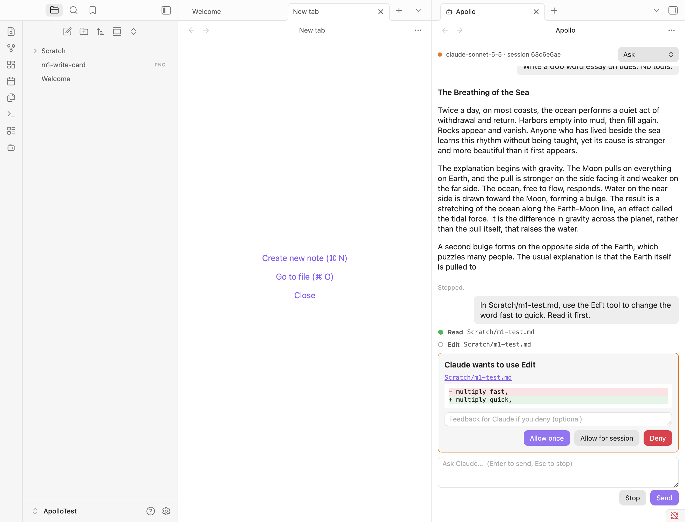

# M1 findings

Tested 2026-10-02 on macOS with Obsidian 1.13.7, Claude Code 2.1.287 and `@anthropic-ai/claude-agent-sdk` 0.3.287. `scripts/probe-m1.mts` checks the SDK behaviour below outside Obsidian; the rest was checked in the dev vault.

## Exit criteria

| Criterion | Result |
|---|---|
| One `ChatView` | `Apollo: Open chat` opens a chat in a vertical split. The M0 spike view is gone. |
| Streaming | One long-lived `query()` per chat in streaming-input mode (`ChatSession`). The process starts on the first message, stays warm between turns, and ends on *New chat*, tab close, plugin unload and quit. If it exits on its own, the next message starts a new one with `resume`. |
| Markdown rendering | Text streams in as plain text and is re-rendered with `MarkdownRenderer` when each block ends. Tool calls show as one-line rows: hollow while pending, then green or red. |
| Stop | Stop (or `Esc` in the input) calls `interrupt()`. The turn ends with `error_during_execution` and the process stays up for the next message. Messages sent during a turn queue in the view and go out together when it ends; Stop puts them back in the input ahead of any draft (PRM-T4). |
| Permission cards, including Auto mode | Inline cards for `canUseTool` (PRM-T2): allow once, allow for session, deny with optional feedback. Edit and Write show a line diff (Write against the file on disk). ExitPlanMode shows the plan with *Approve, accept edits* / *Approve, ask for edits* / *Keep planning*. AskUserQuestion shows the questions as a form. In Auto mode the card says Auto mode needs your approval. Pending cards are cancelled by Stop. |
| Permission modes | Header dropdown: Ask, Accept edits, Plan, Auto, switched mid-chat with `setPermissionMode` (PRM-T1). The default is a setting. The dropdown follows mode changes Claude Code reports (`init` and `status` messages), e.g. after plan approval. |
| *New chat in current pane* hotkey | `Mod+Alt+N`. In a chat it starts a fresh session in place; elsewhere it opens a new chat. `/new` in the input does the same. |
| Prompt mode: default only | `systemPrompt: { type: 'preset', preset: 'claude_code' }`, unchanged from M0. |

## SDK behaviour

- **Streaming input.** `init` arrives before the first turn's output, and every turn ends with one `result`. Several turns on one process share a session ID.
- **`interrupt()`** resolves with `{ still_queued: [] }` and the turn's `result` has subtype `error_during_execution`. A further message on the same process works normally. Apollo queues messages itself rather than pushing them into the SDK mid-turn, so nothing is left in Claude Code's queue.
- **Bare deny.** Returning `interrupt: true` with a deny ends the turn the same way as Stop, matching the CLI's plain "No". Deny with feedback returns `interrupt: false`, so Claude carries on with the feedback.
- **`setPermissionMode()`** takes effect on the next tool call. Claude Code reports the change in a `status` message with `permissionMode`.
- **Allow for session.** Passing the request's `suggestions` back as `updatedPermissions` (with `destination: 'session'`) works. For Edit and Write, the suggestion is `setMode: acceptEdits`, not a rule, so the card labels that button *Allow all edits this session*.
- **ExitPlanMode** arrives through `canUseTool` with the plan text in `input.plan`. Allowing it with `updatedPermissions: [{ type: 'setMode', mode, destination: 'session' }]` sets the mode for the rest of the session.
- **AskUserQuestion** arrives through `canUseTool`. Allowing it with `updatedInput: { ...input, answers: { [question]: label } }` hands the answers to Claude.

## Auto mode (spec §9 Q8)

- **`permissionMode: 'auto'` alone is enough.** No `enable-auto-mode` extra arg.
- **The model must support it.** `supportedModels()` marks support with `supportsAutoMode`; Haiku doesn't have it. On Haiku the session runs in `default` even though `initializationResult()` reports `current_permission_mode: "auto"`. Only the `init` *message* shows the real mode, so Apollo reads that and tells the user when Auto fell back to Ask.
- **What reaches the card.** The classifier approves most calls itself. It approved `touch` and even `rm -rf Scratch` when the user had asked for exactly that. Calls it escalates reach `canUseTool`, as do calls forced by a `permissions.ask` rule. The card can't tell these apart: `canUseTool` doesn't get `decision_reason_type`, and in testing an ask rule set neither `decisionReason` nor `matchedAskRule`. The card says "Auto mode needs your approval for this call", which is true either way.
- **Auto denials** arrive as `system`/`permission_denied` messages and are shown as notes.

## Not done in M1

- Subagent output (`parent_tool_use_id` set) is not shown. Only the main thread is.
- Tool rows can't be expanded yet (RND-2, M6), and the diff doesn't open the file at the changed line (RND-3).
- Tab titles, status dots on tabs, state restore and idle release are M2 (TAB-4 to TAB-6).
