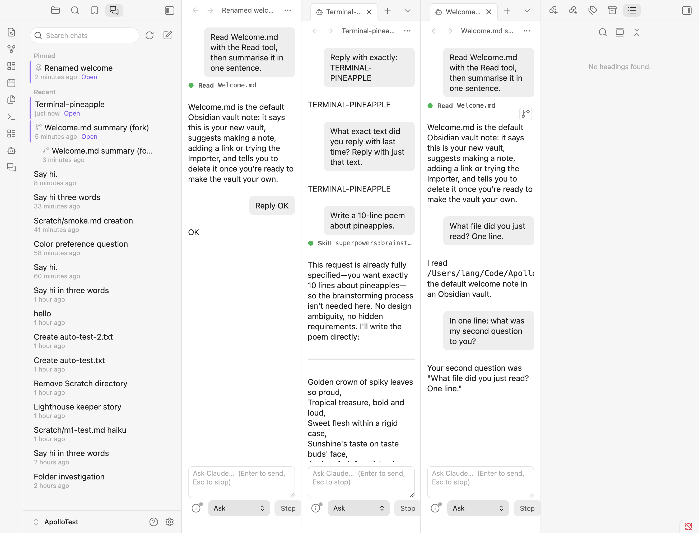

# M2 findings

Tested 2026-10-02 on macOS with Obsidian 1.13.7, Claude Code 2.1.287 and `@anthropic-ai/claude-agent-sdk` 0.3.287. `scripts/probe-m2.mts` checks the SDK behaviour below outside Obsidian; the rest was checked in the dev vault.

## Exit criteria

| Requirement | Result |
|---|---|
| TAB-1 | Each chat is its own leaf. Several can run at once, each with its own Claude Code process. |
| TAB-2 | **Open new chats in**: New tab, Split right (default), Split down, Right sidebar. New chats, resumed chats and forks all follow it. |
| TAB-3, TAB-3a | Commands: *New chat*, *New chat in split*, *New chat in current pane* (`Mod+Alt+N`, or `/new`), *Close chat*, *Focus next chat*, *Focus previous chat*, *Open chat list*. Focus commands put the cursor in the chat input. |
| TAB-4 | The tab title and view header show the first line of the first prompt until Claude Code names the session. Claude Code's generated title (e.g. "Welcome.md summary") was there by the end of the first turn. Renames show up at once. A dot on the tab icon shows running (green), awaiting permission (orange) or error (red). Idle tabs show no dot, to keep quiet tabs quiet. |
| TAB-5 | Saved per leaf: session ID, title, draft, scroll position (or "at the end") and permission mode. After a vault reload, every chat came back with its history and draft. No process starts until the next message. |
| TAB-6 | **Idle process timeout**, default 10 minutes, 0 to never release. After the timeout the process exits. The next message starts a new one with `resume`, and the conversation carries on (tested with a 3 s timeout). |
| HIST-1, HIST-2 | *Claude chats* sidebar (left): `listSessions({ dir: vault, includeWorktrees: false })`, newest first, pinned chats in their own group. Each row shows title, relative time and an *Open* marker for chats open in a tab, including tabs Obsidian hasn't loaded yet. Search filters by title. The list refreshes after each turn, on renames, forks and deletes, and when Obsidian regains focus, so terminal sessions appear on their own. |
| HIST-3 | Row click opens the chat, or focuses its tab if already open. Right-click or `⋯`: Open, Fork, Rename, Pin/Unpin, Copy session ID, Delete (with confirm; closes its tabs). Rename and Delete use the SDK's `renameSession` and `deleteSession`, so the CLI sees them too. Pins and fork parents live in `data.json`. The tab's pane menu also has Rename, Fork and Copy session ID. |
| HIST-3a | Each user message and assistant text block has a *Fork from here* button on hover. Forks open in a new chat titled "*parent title* (fork)" and nest under their parent in the list. See below for how forks are made. |
| HIST-4 | Both directions work. A session started in Apollo resumed from the terminal (`claude -p --resume <id>` recalled the conversation). A `claude -p` session run in the vault showed up in the list, opened with its history and continued in Apollo. The terminal's `claude --resume` picker lists Apollo's sessions. |
| HIST-5 | Opening a session replays `getSessionMessages`: prompts, assistant text rendered as Markdown, and tool rows marked done or failed. Slash commands are shown as `/name args`. Interruptions are shown as "Stopped.". Reminders and local command output are hidden. |

## How forks are made

Apollo calls the SDK's **`forkSession(id, { upToMessageId })`** rather than starting a query with `resume` + `resumeSessionAt` + `forkSession: true` (spec §6). Both work (probe step 4), but `forkSession()` writes the new transcript immediately, without starting a process. So the fork is in the list at once, its history replays like any other session, and opening it costs nothing until you send a message. Resuming the fork then uses plain `resume`.

- **From an assistant message**, the fork keeps everything up to and including that text block.
- **From a user message**, the fork keeps everything *before* it and puts the message in the new chat's input, ready to edit and resend. Branching at the user message itself would leave an unanswered prompt that the next message gets appended to. Forking before the first message just opens a new chat with the prompt in the input.
- `forkSession` names forks "*title* (fork)". A fork of a fork would get "(fork) (fork)", so Apollo passes its own title with a single suffix.

## SDK behaviour

- **Message UUIDs match the transcript.** A `uuid` set on a streamed `SDKUserMessage` becomes that entry's UUID, and streamed `SDKAssistantMessage.uuid`s match too. So live messages can be forked straight away, without re-reading the transcript. Each content block is its own transcript entry with its own UUID (thinking, text and tool_use separately).
- **Assistant messages arrive after their block's stream events.** Apollo gives each streamed text block the UUID of the next assistant message carrying a text block.
- **Titles.** `SDKSessionInfo.summary` is the custom title, else Claude Code's generated title, else the first prompt. `getSessionInfo` reads one file, so each chat refreshes its own title whenever the store says something changed.
- **`listSessions` and the terminal picker.** Sessions started through the SDK are tagged `entrypoint: "sdk-ts"`. `listSessions({ includeProgrammatic: false })` hides them, and the SDK docs say that matches the terminal's `/resume`. In 2.1.287 it doesn't: running `claude --resume` in a pty listed `sdk-ts` sessions next to CLI ones. Apollo keeps the SDK default (include them), and doesn't override `CLAUDE_CODE_ENTRYPOINT`.
- **`deleteSession`** removes the transcript and its subagent folder. A deleted session's forks move up to its parent in Apollo's metadata.

## Q10: forking from an assistant message

**`upToMessageId` (and `resumeSessionAt`) accept any transcript entry's UUID: user, assistant text, or tool_use.** Forking at a text block, including one mid-turn before a tool call, resumes cleanly. Forking at a **tool_use entry** whose result was cut off also resumes, but Claude Code treats the call as failed ("No response requested." in the probe). Apollo only offers *Fork from here* on text, so this doesn't come up. The SDK's `resumeDropsTurn` option can guard truncating resumes; Apollo doesn't need it because `forkSession()` copies rather than truncates.

## Obsidian notes

- There's no public API for a leaf's tab header. Apollo uses the internal `leaf.updateHeader()` (it refreshes the tab title only), `view.titleEl` for the view header, and `leaf.tabHeaderEl` for the status dot. All three are optional-chained, so a future Obsidian without them just loses the refresh or dot.
- Obsidian can leave a leaf in the main area outside any tab group. Opening a leaf when the main area is empty does this. `getLeaf('tab')` next to such a leaf adds another bare leaf with no tab bar, which looks like a split. When the most recent leaf isn't in a `WorkspaceTabs`, Apollo splits from it with `createLeafBySplit` instead, which wraps the new leaf in a tab group. Later chats then open as real tabs in that group.
- Deferred (not yet shown) tabs have no view. Their session ID comes from `leaf.getViewState().state`, which is what the list's *Open* markers and "focus if already open" use.
- `obsidian plugin:reload` right after a build, while Hot Reload is also reloading, can leave chat tabs empty. A single reload restores them. This only affects development.
- `obsidian dev:screenshot` sometimes captures a half-painted frame when Obsidian is in the background. Take several.

## Not done in M2

- **`Mod+Alt+N` doesn't fire from a real keypress on Lang's Mac.** Arc's global "New Little Arc window" shortcut held Cmd+Option+N at first; it was removed from Arc, but the keypress still does nothing. The same key event injected through DevTools (`Input.dispatchKeyEvent`, `key: "Dead"`, `code: "KeyN"`, keyCode 78, as macOS sends Option+N) runs the command, so Obsidian's binding works. Something before Obsidian probably still takes the keypress. Unresolved.
- **Max running processes** (§5, default 4) isn't enforced. Idle release keeps the count down in practice.
- HIST-6 (chat links) is optional and left for M6.
- Subagent output still isn't shown, live or in history.
