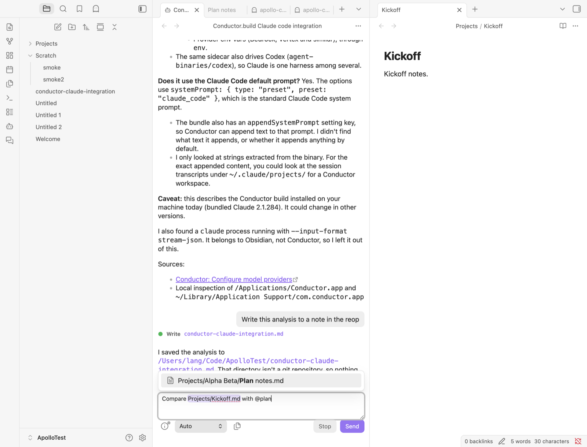
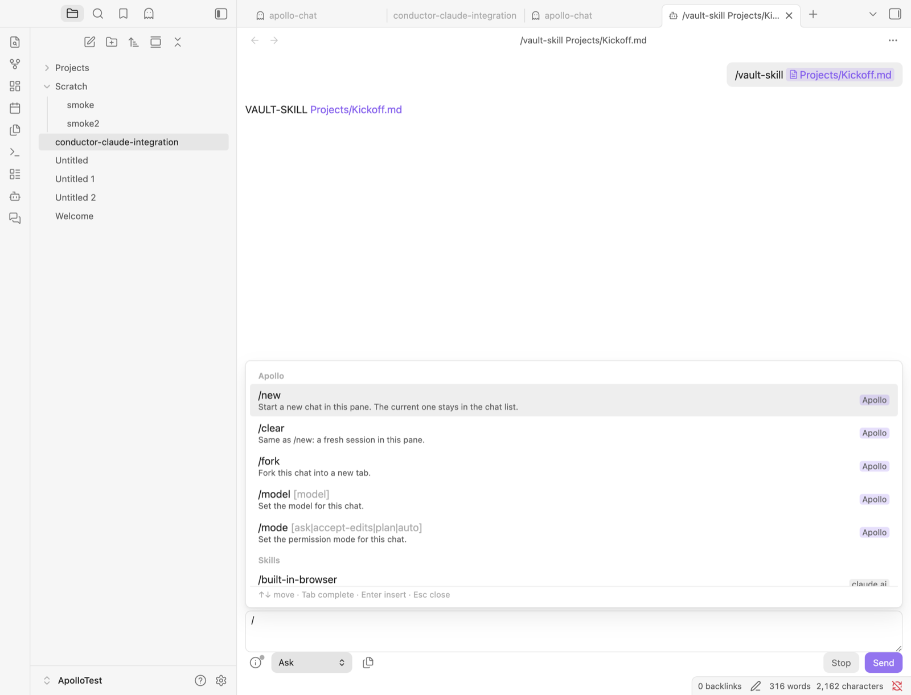

# M3 findings

Tested 2026-10-02 on macOS with Obsidian 1.13.7, Claude Code 2.1.287 and `@anthropic-ai/claude-agent-sdk` 0.3.287. `scripts/probe-m3.mts` checks the SDK behaviour below outside Obsidian. The rest was checked in the dev vault, driven through `obsidian eval` and CDP mouse events.

## Exit criteria: path helper

| Requirement | Result |
|---|---|
| CTX-1 | Typing `@` (at the start, after whitespace or after a bracket) opens a picker above the input. It fuzzy-matches every vault file and folder path with Obsidian's `prepareFuzzySearch`, showing the top 50. With nothing typed yet, it lists recent files. Enter or click inserts the reference. Tab on a folder completes to `@Folder/` so you can keep narrowing. Esc closes it, and it stays closed while you keep typing that token. |
| CTX-2 | Dropping files from the file explorer inserts references, including folders, multi-selections, links and tab headers (Obsidian's internal `dragManager.draggable`), `obsidian://open` URLs and files from Finder (Electron `webUtils.getPathForFile`). Tested with a real mouse drag from the explorer: the reference is inserted and Obsidian doesn't open the file in the pane. Plain text drops still behave as usual. |
| CTX-3 | Right-clicking a file or folder offers *Add to chat* and *Add to new chat*. With several items selected, it offers *Add N items to chat* and *Add N items to new chat*. These are two menu items rather than a submenu, because `MenuItem.setSubmenu` isn't public API. *Add to chat* goes to the chat that last had focus. If no chat has had focus since startup, it goes to an open chat that is on screen, and if there is none, it opens a new chat. The items get a group of their own, between separators (see *Menu sections* below). |
| CTX-4 | *Add current note to chat*, with `Mod+Shift+L` as its default hotkey. |
| CTX-5 | *Add selection to chat* (command, and in the editor's right-click menu) inserts `path:L10-L24` followed by the selected lines as a `>` quote, on lines of its own. A selection that ends at the start of a line doesn't count that line. The path is always plain, never an @-mention: the quote already carries the text, so attaching the whole file would be redundant. In the editor menu it's a group of its own after the clipboard items. |
| CTX-6 | Pasting an absolute path or `file://` URL inside the vault inserts a vault-relative reference. Paths outside the vault are pasted as typed, highlighted in orange, and a warning line above the input says Claude may need permission to read them. The warning goes away when the path is deleted. Files copied in Finder are handled the same way. |
| CTX-7 | A toolbar button lists the notes open in tabs, including tabs Obsidian hasn't loaded yet. Click one to insert it, or choose *Add all open notes*. Sidebar panels such as backlinks are left out. |
| CTX-8 | **Reference format** setting: *Plain path* (default) or *@-mention*. Folders end in `/`. Paths with spaces are quoted (`"Projects/Alpha Beta/Plan notes.md"`, `@"…"`) because Claude Code only expands quoted mentions (see below). |
| CTX-9 | References in sent messages are chips with a file or folder icon. Click to open, Mod-click for a new tab. Chips come back when history is replayed. In the input, references are drawn as chips behind the text (see below). |
| CTX-10 | Paths in assistant output become links. That covers inline code holding a path, and plain-text paths containing a `/` or `.`, whether vault-relative or absolute inside the vault, with an optional `:L10` suffix. Code blocks and existing links are left alone. Tool rows link their file path. Wikilinks in output now open too. Files open in the most recent note pane. If that pane would hide the chat (same tab group), they open in a split beside the chat instead. Folders are revealed in the file explorer. |

## Exit criteria: slash menu

| Requirement | Result |
|---|---|
| SLS-1 | `/` at the start or after whitespace opens the menu. Each row shows the name, argument hint, description and a source badge. Arrows move, Tab completes the name, Enter or click inserts `/name `, and Esc closes the menu. With nothing typed yet, rows are grouped; once you type, they're ranked by fuzzy match. |
| SLS-2 | Groups: **Apollo** (`/new`, `/clear`, `/fork`, `/model`, `/mode`), **Skills** (vault, user, plugin, claude.ai-synced), **Commands** (`.claude/commands`, nested folders as `group:name`), **MCP prompts**, and **Claude Code** (built-ins such as `/compact`, `/context`, `/init`, and bundled skills). Skills from the Skills folder aren't listed yet, because that setting doesn't exist until M5 (SKL-1). Adding them will be one more scan root in `catalogue.ts`. |
| SLS-3 | `CommandCatalogue` scans `<vault>/.claude/skills`, `<vault>/.claude/commands`, `~/.claude/skills`, `~/.claude/commands`, and the `skills/` and `commands/` folders of each enabled Claude Code plugin. Enabled plugins come from `enabledPlugins` in user, project and local settings, and are located through `~/.claude/plugins/installed_plugins.json`. It parses `name`, `description` and `argument-hint` from frontmatter. A command without a description uses its first line. The scan runs after layout-ready. The results, plus whatever the last session reported, are cached in `data.json`, so the menu is complete on the first keystroke after a restart. |
| SLS-4 | Obsidian doesn't index dot-folders, so vault events never fire for `.claude/`. Instead, Apollo watches `<vault>/.claude` with a recursive `fs.watch` once that folder exists. A skill added from the shell appeared in the menu within about a second. `~/.claude` is re-scanned when Obsidian regains focus (at most every 3 s) and after each turn. Re-scans only re-parse files whose mtime changed. |
| SLS-5 | When a session starts, Apollo reads `supportedCommands()` and `supportedModels()`, plus `skills` and `terminal_slash_commands` from the init message. It also listens for `commands_changed` messages. Entries that only Claude Code reports are added: built-ins, synced claude.ai skills, plugin skills from plugins the scan can't locate, and MCP prompts. Scanned entries that Claude Code didn't load, or that a same-named entry shadowed, are dimmed and sink to the bottom with the reason ("Claude Code didn't load this", "Shadowed by the user command of the same name"). Files added after that session started aren't flagged. |
| SLS-6 | Skills and commands are sent as typed and run natively (Q13 below). Apollo's own commands are handled locally and never sent. `/new` and `/clear` start a fresh session in the pane. `/fork` forks the chat into a new tab. `/model [name]` sets the chat's model: it takes effect at once if a process is running, otherwise from the next message, and it is saved with the tab. Without a name it shows a picker of the models Claude Code last reported. `/mode [ask\|accept-edits\|plan\|auto]` switches the permission mode, and without an argument it shows a picker. |
| SLS-7 | Hidden from the menu: everything in `terminal_slash_commands` (in 2.1.287, `doctor`, `color`, `focus` and `reload-plugins`), a fixed list of terminal-only commands (`terminal-setup`, `vim`, `statusline`, `ide`, `exit`, `login`, `resume`, …), internal `__*` commands and `workflow-launch-exec`, and Claude Code's `clear`, `new` and `model`, which Apollo replaces. |
| SLS-8 | When the model invokes a skill, its `Skill` tool call renders as a "Skill *name*" row. When the user invokes one, a skill row follows the `/name` prompt, live and in replayed history. The name links to its `SKILL.md`. Files Obsidian has indexed open as notes; others, including everything under `.claude/`, open in the system editor. |
| SLS-9 | The menu is built from the in-memory catalogue, with no process spawn and no network. Measured in a visible chat pane, from the input event through forced layout: `/` (89 entries) took 11 to 15 ms, `/s` 14 ms and `/super` 7.5 ms. Rendering every row at once took about 40 ms, almost all of it layout (about 0.3 ms per row), so the menu renders 30 rows and adds more as you scroll or arrow past them. The `@` picker took 4 to 6 ms, but this dev vault only has 13 files and folders, so it hasn't been measured on a large vault. Time to paint can't be measured from a script while Obsidian is in the background (no animation frames), so these are synchronous times. |

## The input

The input is still a plain `<textarea>`, so typing, undo, IME and spellcheck behave natively. A backdrop behind it has the same font, padding, wrapping and scroll position, and draws references as chips, a leading known `/command` in purple, and paths outside the vault in orange. The backdrop draws only highlight boxes; the text you see is the textarea's own, so the chips can't drift out of line with it. Insertions go through `execCommand("insertText")` so they can be undone.

`execCommand` only inserts text while Obsidian's window has focus. When it fails, Apollo falls back to `setRangeText` and fires an `input` event, so references still go in (without undo).

## Spec §9 answers

**Q13. Does `/skill-name args` sent as prompt text run the skill as in the CLI?** **Yes.** `/probe-skill banana` replied `PROJECT-SKILL banana`. Commands work too, including nested ones (`/group:nested`). MCP prompts are named `<server>:<prompt> (MCP)`, spaces included, and run when sent by that full name (`/claude.ai Strava:training_load (MCP)` ran the prompt). The transcript stores the user entry as `<command-message>…<command-name>/probe-skill</command-name><command-args>banana</command-args>`, which history replay already shows as `/probe-skill banana`. Nothing in the stream marks a user-invoked skill, so Apollo adds the skill row itself. A model-invoked skill is a `Skill` tool call with `{ skill: "codeword" }`, and its result is "Launching skill: codeword".

**Q13, continued. Does `supportedCommands()` need a live query?** It needs a `query()`, but not a turn. It resolves together with `initializationResult()`: about 250 to 700 ms after spawn, with no model call, and 0 ms after that. Apollo only calls it on sessions it is already starting for a message, so plugin load still spawns nothing. Descriptions carry a source tag: `… (project)`, `… (user)`, `(plugin) …` and `… (claude.ai sync)`. Built-ins have `builtin: true`, and that includes bundled skills such as `dataviz` and `claude-api`.

**Q14. Which wins when a skill exists at both user and project level?** **The user one.** With `probe-skill` in both the project and a throwaway `CLAUDE_CONFIG_DIR`, `supportedCommands()` listed only the user copy ("User copy of the probe skill. (user)"). The catalogue follows this precedence and dims the project copy as shadowed.

## Quoted @-mentions (CTX-8)

Run with tools off, so file contents could only arrive by expansion:

- `@"My Notes/secret note.md"` attached the file (the reply was the codeword).
- `@My\ Notes/secret\ note.md` did not (the reply was `NONE`).
- `@"My Notes/"` listed the folder's files.

So references with spaces are quoted. A quoted plain path, without the `@`, is just text to Claude, which is all the plain format promises.

## Menu sections

Obsidian groups menu items by `setSection`. Each menu sets its own section order, and any section it doesn't list goes after *Delete*. Core fills different sections in different menus, so no single ID gives *Add to chat* a group of its own everywhere:

| Menu | Sections (in order) | Core uses | Apollo's group |
|---|---|---|---|
| File (explorer) | title, open, action-primary, action, info, info.copy, view, system, "", danger | open, action, info.copy (*Copy path*), view, system, danger | action-primary: just below the Open items |
| Folder, multi-selection | same | action-primary (*New note*, *New folder with selection*), action, danger | open: at the top |
| Note's *More options* | close, pane, open, action, find, info, info.copy, view, view.linked, system, "", danger | pane, open, action, find, info.copy, view, system, danger | close: at the top |
| Editor | title, correction, spellcheck, open, selection-link, selection, …, clipboard, info, info.copy, action, view, "", danger | selection, clipboard, … | action: after the clipboard items |

For file menus, Apollo takes the first of action-primary, open and close that the menu lists (the internal `menu.sections`) and hasn't used yet (`menu.items`), falling back to `action`. `info` looks free but merges visually with *Copy path*, which is `info.copy`.

## Obsidian notes

- `--interactive-accent-rgb` isn't defined, so colours built from it silently disappear. Use `--color-accent-hsl` (`hsla(var(--color-accent-hsl), 0.2)`) or the `--color-*-rgb` palette variables.
- `iterateAllLeaves` and `iterateRootLeaves` stop at the first callback that returns a truthy value. Arrow functions with expression bodies, such as `l => a.push(l)`, stop after one leaf.
- Menus (`Menu.showAtMouseEvent`) don't appear while Obsidian is in the background, which affects eval- and CDP-driven tests. That's true of the M2 chat-list menu as well. To check the open-notes menu, I captured its items instead.
- After a Hot Reload, chat leaves come back deferred, so views held from before the reload are stale.
- Layout costs are only real in a visible pane. My first timings (4 ms for the full slash menu) came from a chat in a background tab; the same menu in a visible pane took 40 ms until it was batched. Setting `scrollTop`, like calling `scrollIntoView`, forces layout synchronously.

## Not done in M3

- Skills folder scanning, until M5 adds the setting (SKL-1).
- The *Load user settings* toggle (CFG-2, M4) doesn't affect the scan yet. User skills and commands are always scanned.
- Chips in the input are drawn highlights, not atomic tokens. Backspace deletes a reference one character at a time.
- The slash menu doesn't complete arguments (for example the model names after `/model `). `/model` and `/mode` without an argument open a picker instead.
- Drops land at the caret, not at the drop point.
