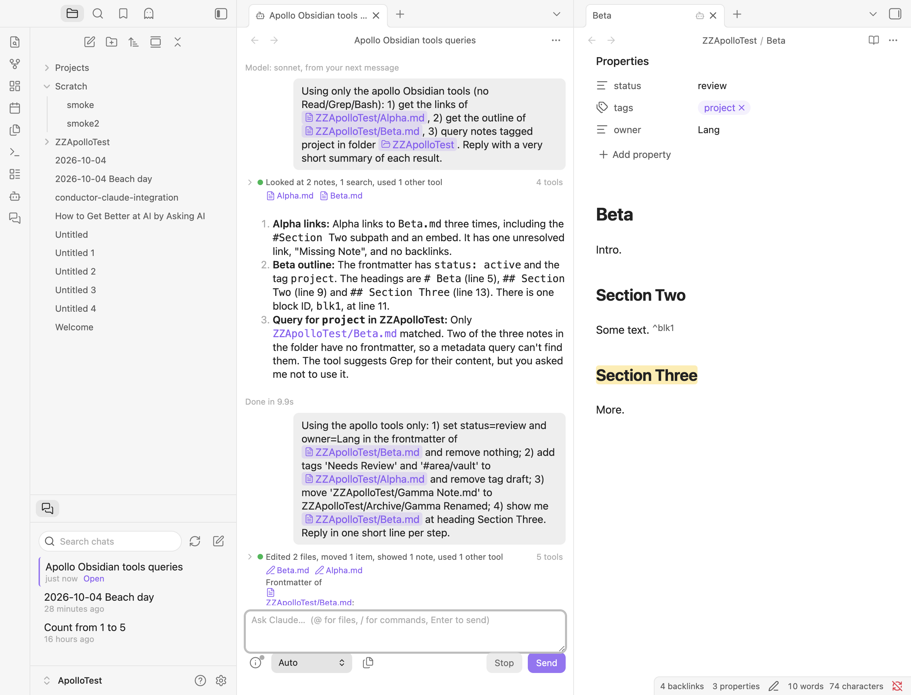
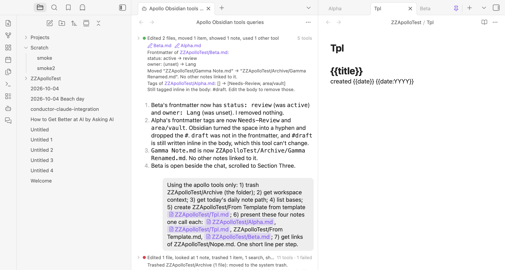

# M5 findings: Obsidian-native tools

Tested 2026-10-04 on macOS with Obsidian 1.13.7, Claude Code 2.1.287 and `@anthropic-ai/claude-agent-sdk` 0.3.287. `scripts/probe-m5.mts` checks the SDK behaviour outside Obsidian. The tools were checked in the dev vault through real Sonnet chats, driven with `obsidian eval`. This covers OBS-1 to OBS-19 only. MCP-1 to MCP-6 and SKL-1 to SKL-5 aren't done yet.

## Requirements

| Requirement | Result |
|---|---|
| OBS-1 | **Include Obsidian tools** (on by default) adds an in-process `createSdkMcpServer` server named `apollo` to each chat's Claude Code process. When it's off, Apollo doesn't register the server. **Choose tools**, a settings sub-page, turns individual tools off; they're stored as `disabledObsidianTools`. Changes apply from a chat's next process. |
| OBS-2 | `vault_links`: outgoing links from `resolvedLinks` with counts, heading and block subpaths, and whether each is embedded. Also unresolved links from `unresolvedLinks`, and backlinks found by scanning `resolvedLinks`. |
| OBS-3 | `vault_outline`: frontmatter, headings, block IDs, inline tags and embeds (with resolved targets), all with 1-based lines. No body. |
| OBS-4 | `vault_frontmatter(path, set?, remove?)` goes through `processFrontMatter`. With neither argument it returns the current properties. It returns a before/after line per changed key. When nothing changes, it doesn't write the note. |
| OBS-5 | `vault_tags(path, add?, remove?)` edits frontmatter `tags`. It drops `#`, turns spaces into hyphens, removes characters Obsidian doesn't allow and rejects all-digit tags. It compares case-insensitively, and reads a comma- or space-separated string as a list. It warns when a removed tag is still written inline in the body. |
| OBS-6 | `vault_query(tags?, folder?, frontmatter?, linksTo?, limit?)` returns paths, newest first. It also reports how many notes in scope have no frontmatter or no tags, and suggests Grep. A tag matches nested tags. A list property matches if it contains the value. `null` means "has the property". `linksTo` falls back to unresolved links when the target doesn't exist. |
| OBS-7 | `vault_move(from, to)` uses `renameFile` for files and folders. It creates missing parent folders and adds the extension if it's left off. If `to` is a folder, the item moves into it. It reports how many notes linked to the item. |
| OBS-8 | `vault_trash(path)` uses `trashFile`. It says where the item went (from the `trashOption` vault config) and how many notes now have dangling links. |
| OBS-9 | `workspace_context()`: the active note, open tabs (pinned, and which one is the presentation pane), and the selection in the active note's editor. |
| OBS-10 | Bridges are registered only when their plugin is enabled at session start. `dataview_query` uses Dataview's `api.queryMarkdown`. `template_create` uses Templater's `create_new_note_from_template` if Templater is enabled; otherwise core Templates, with `{{title}}`, `{{date}}`, `{{time}}` and `{{date:FORMAT}}` filled in. `daily_note(date?)` uses the core Daily notes folder and format. `bases_query(path?, view?)` lists `.base` files, or returns a view's rows through Obsidian's own `base:query` CLI handler (internal; there's no public API for evaluating a base). Bases, core Templates and Daily notes were tested. Dataview and Templater aren't installed in the dev vault, so they're untested. |
| OBS-11 | Shell `mv` and `rm` aren't blocked. Until the Apollo output style exists (M4), the preference for `vault_move`, `vault_trash`, `vault_frontmatter` and `vault_tags` is stated in the server's MCP `instructions`. Claude Code shows those to the model only while the tools are on. **This is plugin-authored text the model sees.** It belongs in the *View injected context* panel (PRM-3) when that's built. |
| OBS-12 | `vault_links`, `vault_frontmatter` and `vault_move` use `tool(..., { alwaysLoad: true })`. The rest are deferred. |
| OBS-13 | Calls join the activity groups with short names (Links, Outline, Frontmatter, Move…), their own progress text ("Moving X", "Reading links of X") and summary terms ("looked at 2 notes, moved 1 item, showed 1 note"). Moves, trashes, property and tag edits, and template creations show their result under the group, even when it's collapsed, with vault paths as links. That result is the before/after summary, and it also replays from saved history. A failed Obsidian tool shows its error under its row. |
| OBS-14 | `workspace_present(path, heading?, line?, placement?)`. Headings and `^block` IDs become a line through `resolveSubpath`. The view scrolls with `eState.line`. The note opens in Obsidian's default mode. |
| OBS-15 | Implemented as specified, plus one exception (below). Each chat has its own server instance, so tool calls know their chat without a session-to-leaf map. A leaf counts as the presentation pane whether step 3 or step 4 created it, so repeated presents don't pile up tabs either. `beside` skips step 3. `tab` skips step 2 and doesn't claim a presentation pane. If step 3 finds nothing, `tab` opens a tab next to the chat. |
| OBS-16 | `createLeafInParent` and `createLeafBySplit` make the new leaf active even with `openFile({ active: false })`, and `revealLeaf` doesn't. So Apollo puts back the previously active leaf and the focused element afterwards. **Present: focus the note** focuses the note instead. |
| OBS-17 | The pane's tab gets a small bot icon after its title, with a tooltip naming the chat. Pinning clears the association at once (`pinned-change`). A closed pane is noticed on the next present. Panes dragged into the chat's own tab group are dropped too. The association lives in memory, so it doesn't survive a plugin reload or a restart. |
| OBS-18 | **Present: max per turn** (default 3). The counter resets on each send, and queued messages count as one send. Over the limit, the tool succeeds but tells the agent to list the notes as links instead. |
| OBS-19 | **Auto-present new notes** (default off). It uses the same presenter and limit, and gives way to any present made after the Write, so it never replaces a note the agent chose to show. |

### Exception to OBS-15 step 1

If the note's only open tab is in the chat's own tab group, revealing it would hide the chat. Apollo treats that note as not open and shows a copy beside the chat instead. Every other open copy is revealed rather than duplicated.

## SDK behaviour (Q15)

- **SDK servers coexist with configured servers.** With a project `.mcp.json` server and claude.ai connectors loaded, `mcpServerStatus()` lists `apollo` (source `sdk`) next to them. With `extraArgs: { "strict-mcp-config": null }`, only `apollo` is left: strict mode keeps SDK servers.
- **`alwaysLoad` works.** The init message's `tools` lists both alwaysLoad and deferred tools, so it can't tell them apart. But the model called the alwaysLoad tool directly, while it fetched the deferred one with `ToolSearch` (`select:mcp__apollo__vault_outline`) first.
- **Read-only tools need `allowedTools`.** `readOnlyHint: true` alone still sends the call to `canUseTool`. Apollo passes the read-only tools (links, outline, query, context, present and the read-only bridges) as `allowedTools`, so they run without a card, like Read and Grep. Ask and deny rules in settings still take precedence. The SDK logs a `CLAUDE_SDK_CAN_USE_TOOL_SHADOWED` warning for each one when a process starts; it's informational. The writing tools go through the permission mode.
- **Handlers get the tool use ID**, as `extra._meta["claudecode/toolUseId"]`. Apollo doesn't need it, because the result text carries the summary.
- **Tool errors** reach the stream and transcript as `is_error` results whose `content` is a plain string, not text blocks.
- **The stream can show a tool call after it has run.** A Write's file can already exist by the time its `tool_use` is handled, so "is this a new note" can't be checked from the stream. Auto-present uses an in-process `PreToolUse` hook (matcher `Write`) instead, which always runs first.

## Obsidian behaviour

- `fileManager.renameFile` updates links even when *Automatically update internal links* is off. That setting only controls the confirmation prompt in Obsidian's own UI.
- `processFrontMatter` writes nothing if the callback throws. Apollo uses this to skip writes that change nothing.
- The core Daily notes instance's `getFolder()` returns a `TFolder`, not a path.
- `createLeafInParent` accepts a `WorkspaceTabs`, though it's typed as taking a `WorkspaceSplit`.
- Settings modals, like menus, don't render while Obsidian is in the background. So the settings page was checked through `getSettingDefinitions()` and the control get/set methods, not by screenshot.

