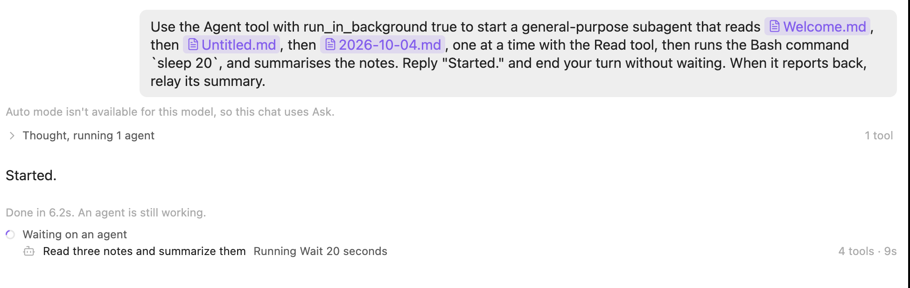

# Progress display (RND-8, RND-9)

Tested 2026-10-07 on macOS with Obsidian 1.14.4, Claude Code 2.1.287 and `@anthropic-ai/claude-agent-sdk` 0.3.287. `scripts/probe-progress.mts` checks the SDK behaviour below outside Obsidian. The rest was checked in the dev vault through real Haiku chats, driven with `obsidian eval`.

## Design

Based on a research summary on showing that an agent is still working. The parts applied here:

- **One place for "now".** The status row at the end of the transcript is the only thing that says what Claude is doing now. The rows above it are a record: a summary of what each run did so far, with no status dots. An earlier version had a fixed line above the input repeating the live row's text, and green, red and spinning dots on every row; both were noise.
- **Questions it answers.** Does Claude need me (orange "Waiting for your answer"), and is it alive (Claude Code's events keep arriving).
- **Escalate by duration.** Nothing for the first second (the line fades in after 1 s). Then the current step. From 10 s, the step's own time ("for 1m 10s") and the turn's elapsed time. Elapsed time only: Claude can't honestly know how much is left.
- **Heartbeat from the harness.** Any message from Claude Code counts, from the main thread or a subagent: stream events, thinking-token estimates, task progress. The model saying it's working doesn't.
- **Going quiet.** No event for longer than the step allows turns the row amber with "No activity for 1m 04s", and stops the spinner. More motion would draw attention without adding information.
- **Failures aren't a signal.** The research suggests counting failures in a row to spot an agent going in circles, but Claude's failed calls are routine (a missing file, a failing test it's fixing) and it just carries on. So failures aren't counted in summaries or warned about; a failed call only gets a red dot in the expanded list.
- **Summary first, detail on demand.** The line shows one step; the transcript rows hold the detail, as before.
- **Leave and return.** A chat that finishes while it isn't on screen in the focused window keeps an accent dot on its tab until you look. No OS notifications yet.

### Defaults to tune

These are judgement calls, not research results.

| Setting | Value |
|---|---|
| Grace before the line appears | 1 s |
| Show step and turn times from | 10 s |
| Quiet budget: thinking, writing, waiting for the model | 45 s (Claude Code's "deep in thought" cue) |
| Quiet budget: web fetch and search, MCP and other tools | 1 min |
| Quiet budget: commands, agents | 3 min |
| Quiet budget per agent row | 3 min |
| Agent rows shown | 3, then "and N more agents" |

## What Claude Code sends while agents run

- **Agents go to the background by default.** Even without `run_in_background`, Claude Code 2.1.287 started the subagent with `is_backgrounded: true`. The Agent call returns at once ("Async agent launched successfully…"), the turn ends with a `result`, and the agent keeps going. Apollo used to say "Done" there and go idle, so a chat waiting on agents looked finished.
- When the agent finishes, Claude Code starts a turn by itself: `system/init`, the reply, then another `result`, with no user message. `session_state_changed` stays `running` from the first message until that last result, then goes `idle`.
- `task_started` (with `tool_use_id`, `description`, `is_backgrounded`) comes before the Agent call's result. `background_tasks_changed` is the full set of background tasks, and sometimes arrives before `task_started`.
- `task_progress` arrives on each of the agent's tool calls, without `agentProgressSummaries`. Its `description` is the current step ("Reading note1.md", "Running Sleep for 20 seconds"), or the task's own description between steps. `usage.tool_uses` counts calls. Apollo leaves `agentProgressSummaries` off, since the step text is already useful and the summaries cost a model call every ~30 s.
- `task_notification` (`completed`, `failed` or `stopped`, with `usage`) marks the end. `task_updated` and `background_tasks_changed` arrive with it.
- A subagent's own messages have `parent_tool_use_id` set to the Agent call. Only its tool calls come through unless `forwardSubagentText` is on.
- An agent's background Bash command (`local_bash`, `is_backgrounded`) can outlive the agent. Apollo doesn't count shell tasks as work, so a dev server started in the background doesn't keep a chat "working". When such a command ends, Claude Code starts a turn by itself, which shows normally.
- **Stopping.** `interrupt()` with no turn running kills background agents at once (`task_notification` `stopped`, then `idle`), with no `result`. That's because Apollo doesn't declare `perTaskStopAffordance`. `stopTask(id)` stops one agent, but Claude Code then starts a turn to tell the model.
- **Saved transcripts.** An agent's report is stored as a user entry starting `<task-notification>`, with `<tool-use-id>`, `<status>` and `<usage>`. Apollo used to show it as a user message.
- No `tool_progress` messages arrived during a 20 s `sleep`, so a long command is genuinely silent, hence its longer quiet budget.
- The idle timeout (TAB-6) used to start at the first `result`, and could close the process, killing agents still running. It now waits until the turn and its agents are done.

## Not done

- OS notifications when a long turn finishes or needs input while Obsidian is in the background (with a never / in background / always setting).
- A nested view of a subagent's own tool calls under its Agent row. The row shows its latest step, totals and edited files.
- Showing "plan updated" when Claude's todo list grows.
